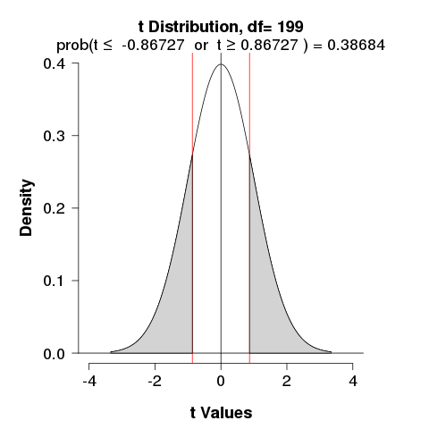

##Graded Questions

Q:1 (5.6) Working backwards, Part II. A 90% confidence interval for a population mean is (65,77). The population distribution is approximately normal and the population standard deviation is unknown. This confidence interval is based on a simple random sample of 25 observations. Calculate the sample mean, the margin of error, and the sample standard deviation.

**_A: ${CI} = \mu \pm \frac{\sigma}{\sqrt{n}}$_**

**_CI~lower~ = 65, sample size (n) = 25, z-value 90% = `r qnorm(.90)` Sample mean($\mu$) = $\frac{(CI~_{lower}~ + CI~_{upper}~)}{2}$ = $\frac{65 + 77}{2}$ = `r (65+77)/2`_**

**_Standrd deviation, using CI lower value $65 = `r (65+77)/2` - (`r round(qnorm(.90),2)` X \frac{\sigma}{\sqrt{25}})$ = 23.44_**

**_Standard error (SE) = $\frac{\sigma}{\sqrt{n}}$ = `r round(23.44/5, 2)`_**

Q:2 (5.14) SAT scores. SAT scores of students at an Ivy League college are distributed with a standard deviation of 250 points. Two statistics students, Raina and Luke, want to estimate the average SAT score of students at this college as part of a class project. They want their margin of error to be no more than 25 points.
  
  (a) Raina wants to use a 90% confidence interval. How large a sample should she collect?
  (b) Luke wants to use a 99% confidence interval. Without calculating the actual sample size, determine whether his sample should be larger or smaller than Raina's, and explain your reasoning.
  (c) Calculate the minimum required sample size for Luke.
  
**_A: (a) Z-score of 90% CI = `r round(qnorm(.90),2)`, Standard deviation($\sigma$) = 250, Margin of error (ME) = $(z-score) X \frac{\sigma}{\sqrt{n}}$, n = `r (qnorm(.90) * (250/25))^2`_**

**_At 90% confidence interval Raina's sample size should be at least 165 students._**

**_(b) Under normal distribution, Z-score value increases as confidence level increases. While, Z-score increases to maintain 25 point margin of error sample should increase._**

**_(b) n = `r (qnorm(.99) * (250/25))^2`, at 99% confidence interval Luke's sample size should be at least 542 students._**

Q:3 (5.20) High School and Beyond, Part I. The National Center of Education Statistics conducted a survey of high school seniors, collecting test data on reading, writing, and several other subjects. Here we examine a simple random sample of 200 students from this survey. Side-by-side box plots of reading and writing scores as well as a histogram of the differences in scores are shown below.


  (a) Is there a clear difference in the average reading and writing scores?
  (b) Are the reading and writing scores of each student independent of each other?
  (c) Create hypotheses appropriate for the following research question: is there an evident difference in the average scores of students in the reading and writing exam?
  (d) Check the conditions required to complete this test.
  (e) The average observed difference in scores is $\bar{x}~_{read - write}~$ = -0.545, and the standard deviationof the differences is 8.887 points. Do these data provide convincing evidence of a difference between the average scores on the two exams?
  (f) What type of error might we have made? Explain what the error means in the context of the application.
  (g) Based on the results of this hypothesis test, would you expect a confidence interval for the average difference between the reading and writing scores to include 0? Explain your reasoning.
  
**_A: (a) Looing at the boxplot reading scores are evenly spread accross the quartiles. Boxplot showing writing scores does not have evenly distributed quartiles and median is not centered. Histogram showing the differences in scores, shows that bins to the left of mean have high number of students. Using these two graphs we can conclude clearly there is difference in average reading and writing scores._**

**_(b) Each score is related to a student in the data set. One value describes reading score and corresponence value decribes writing score for the same student. This data set is considered to be paired data. Hence both scores are dependent._**

**_(c) We would be  considering two scenarios: there is no difference or there is some difference in average scores of students in the reading and writing exam._**

**_Null hypothesis H~0~: $\mu~_{read - write}~ = 0$. There is no difference in the average scores of students in the reading and writing exam._**

**_Alternative hypothesis H~A~: $\mu~_{read - write}~ \ne 0$. There is a difference in the average scores of students in the reading and writing exam._**

**_(d) The observations are based on a simple random sample from less than 10% of the high school senior students, independence is reasonable. Histogram showing difference in scores (read - write) does not show strong skew. Sampel size is reasonable large (n = 200). Based on these conditions the t-distribution can be used to make inference._**

**_(e) Mean of difference of scores $\bar{x}~_{read - write}~ = -0.545$, Standard deviation($S~_{read - write}~ = 8.887$), Number of observations($n~_{read - write}~ = 200$)_**

**_Standard Error $SE~_{\bar{x}}~ = \frac{S~_{read - write}}{\sqrt{n~_{read - write}~}} = \frac{8.887}{\sqrt{200}}$ = `r round(8.887/sqrt(200),2)`_**

**_T-score = $\frac{\bar{x}~_{read - write}~ - 0}{SE~_{\bar{x}}} = \frac{-0.545 - 0}{`r round(8.887/sqrt(200),2)`}$ = `r round(-0.545/round(8.887/sqrt(200),2),2)`_**

**_We are intersted in the area that falls in two tails, two-sided p-value = `r 2*pt(-0.545/(8.887/sqrt(200)), 199)`_**



**_Since significance level is not mentioned, 5% level is assumed. p-value is greater than 0.05(significance level), we accepct null hypothesis and reject alternative hypothesis. Evidence is convincing that there is no difference in the average scores of students in the reading and writing exam._**

**_(f) We have made a Type II error. We failed to reject null hypothesis when Boxplot, Histogram and mean of difference of scores that is not equal to zero clearly suggest alternative hypothesis is actually true._**

**_(g) Since confidence level is not mentioned, 95% level is assumed. $CI = {point estimate}(\mu) \pm {`r qnorm(.95)`} * SE = -0.545 \pm {`r qnorm(.95)`} * `r round(8.887/sqrt(200),2)`$ = (`r c(-0.545 -(qnorm(.95) * round(8.887/sqrt(200),2)), -0.545 +(qnorm(.95) * round(8.887/sqrt(200),2)))`). Yes, confidence interval for the average difference between the reading and writing scores include 0._**

Q:4 (5.32) Fuel efficiency of manual and automatic cars, Part I. Each year the US Environmental Protection Agency (EPA) releases fuel economy data on cars manufactured in that year. Below are summary statistics on fuel efficiency (in miles/gallon) from random samples of cars with manual and automatic transmissions manufactured in 2012. Do these data provide strong evidence of a difference between the average fuel efficiency of cars with manual and automatic transmissions in terms of their average city mileage? Assume that conditions for inference are satisfied.


**_A: We would be  considering two scenarios: there is no difference or there is some difference in average fuel efficiency of cars with manual and automatic transmissions._**

**_Null hypothesis H~0~: $\mu~_{manual - automatic}~ = 0$. There is no difference in the average fuel efficiency of cars with manual and automatic transmissions._**

**_Alternative hypothesis H~A~: $\mu~_{manual - automatic}~ \ne 0$. There is a difference in the average fuel efficiency of cars with manual and automatic transmissions._**

**_Point Estimate of difference in means(PE) $\bar{x}~_{manual - automatic}~ = \bar{x}~_{manual} - \bar{x}~_{automatic} = 19.85 - 16.12 = `r 19.85 - 16.12`$_**

**_Standard Deviation manual $\sigma~_{manual} = 4.51$, Standard Deviation automatic $\sigma~_{automatic} = 3.58$_**

**_Number of observations manual $n~_{manual}~ = 26$, Number of observations automatic $n~_{automatic}~ = 26$_**

**_Standard Error $SE~_{\bar{x}~_{manual - automatic}~}~ = \sqrt{\frac{\sigma^2~_{manual}~}{n~_{manual}~} + \frac{\sigma^2~_{automatic}~}{n~_{automatic}~}} = \sqrt{\frac{4.51^2}{26} + \frac{3.58^2}{26}} = `r sqrt(((4.51^2)/26) + ((3.58^2)/26))`$_**

**_T-value = $\frac{PE - null \space value}{SE} = \frac{`r 19.85 - 16.12` - 0}{`r sqrt(((4.51^2)/26) + ((3.58^2)/26))`} = `r (19.85 - 16.12)/sqrt(((4.51^2)/26) + ((3.58^2)/26))`$_**

**_We are intersted in the area that falls in two tails, two-sided p-value = `r 2*pt(-1*(19.85 - 16.12)/sqrt(((4.51^2)/26) + ((3.58^2)/26)), 25)`_**


**_Since significance level is not mentioned, 5% level is assumed. p-value is less than 0.05(significance level), we reject null hypothesis and accepct alternative hypothesis. Evidence is convincing that there is a difference in the average fuel efficiency of cars with manual and automatic transmissions._**

Q:5 (5.48) Work hours and education. The General Social Survey collects data on demographics, education, and work, among many other characteristics of US residents. Using ANOVA, we can consider educational attainment levels for all 1,172 respondents at once. Below are the distributions of hours worked by educational attainment and relevant summary statistics that will be helpful in carrying out this analysis.


  (a) Write hypotheses for evaluating whether the average number of hours worked varies across the five groups.
  (b) Check conditions and describe any assumptions you must make to proceed with the test.
  (c) Below is part of the output associated with this test. Fill in the empty cells.


(d) What is the conclusion of the test?

**_A: (a) ANOVA uses a single hypothesis test to check whether the means across many groups are equal._**

**_Null hypothesis: The average number of hours worked by each group of educational attainment is identical to the other group of educational attainment._**

**_H~0~: $\mu_{less \space than \space HS} = \mu_{HS} = \mu_{Jr \space coll} = \mu_{Bachelor} = \mu_{Graduate}$_**

**_Alternative hypothesis: The average number of hours worked varies accross some or all groups of educational attainment._**

**_H~A~: At least one mean is different._**

**_ (b) 1. Since random sample size is 1172, it is less than 10% of actual population size of US residents. This satisfies condition of independence._**

**_2. Looking at side-by-side box plot for average number of hours worked by each group of educational attainment, it does not show any prominent outliers. However HS group shows it is right skewed and Bachelor's group is left skewed, this suggests that there is some deviation from normality in the groups. Since sample size for HS group is 546 observations and Graduate group has 155 observations they are large enough that skewness is acceptable. This mets approximately normal condition._**

**_3. Looking at side-by-side box plots accross the groups variability is similar in all groups of educational attainment but not identical. From the table we can read standard deviation varies from group to group. Since it is ressonably consistent, it mets constant variance._**

**_(c) Associated degrees of freedom, $df_{G} = k - 1$ where k represents number of groups. I this case there are 5 groups namely (Less than HS), HS,  (Jr Coll),  (Bachelor's) and  (Graduate). Hense $df_{degree} = 4$_**

```{r, echo=T, message=F}
# Using library Statistics for psychiatric research
library(rpsychi)
library(dplyr)
library(knitr)

# Create vectors for summary values
edu.mean <- c(38.67, 39.6, 41.39, 42.55, 40.85)
edu.sd <- c(15.81, 14.97, 18.1, 13.62, 15.51) 
edu.sample <- c(121, 546, 97, 253, 155)

# Create data frame
edu.data.frame <- data.frame(edu.mean, edu.sd, edu.sample)

# Get ANOVA details
edu.details <- with(edu.data.frame, ind.oneway.second(edu.mean, edu.sd, edu.sample))

# Extract ANOVA table
edu.anovatable <- edu.details$anova.table

# Calculate p-value
p <- pf(edu.anovatable$F[1], edu.anovatable$df[1], edu.anovatable$df[2], lower.tail = F)
p <- c(p, NA, NA)

# Bind p-value to ANOVA table
edu.anovatable <- cbind(edu.anovatable, p)

#Rename column name
edu.anovatable <- rename(edu.anovatable, `Df` = `df`, `Sum Sq` = SS, `Mean Sq` = MS, `F value` = `F`, `Pr(>F)` = `p`)
edu.anovatable <- edu.anovatable %>% select(Df,`Sum Sq`,`Mean Sq`,`F value`,`Pr(>F)`)

#Rename row names
rownames(edu.anovatable) <- NULL
rnames <- c("degree","Residuals","Total")
edu.anovatable <- cbind(" " = rnames, edu.anovatable)

kable(edu.anovatable, format="pandoc", align="r", digits = 4, row.names = F)
```


**_(d) The p-value is larger than 0.05, indicating the evidence is not strong enough to reject the null hypothesis at a significance level of 0.05. That is, the data do not provide strong evidence that the average number of hours worked varies accross some or all groups of educational attainment._**


References: 

http://stackoverflow.com/questions/26170002/anova-in-r-using-summary-data

http://homepage.divms.uiowa.edu/~mbognar/applets/f.html

https://onlinecourses.science.psu.edu/stat414/node/218

